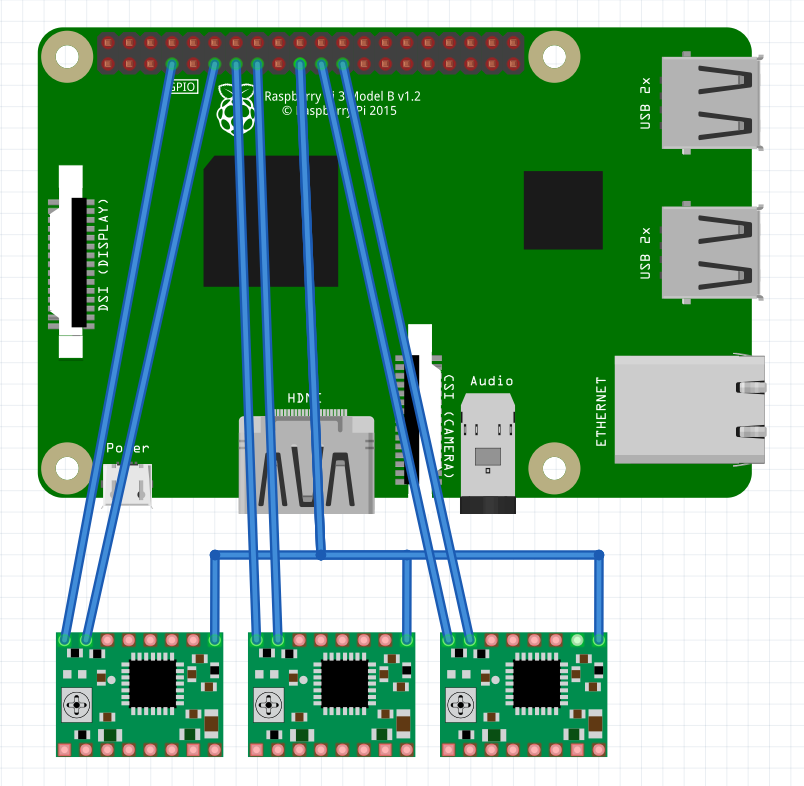

# raspigcd2

[](https://travis-ci.org/pantadeusz/raspigcd)

The G-CODE interpreter for Raspberry Pi 3 (it works on older versions, but untested)

Recent experiments: 
 * [bigger machine](https://www.youtube.com/watch?v=A7HaYQWpmmg)
 * [smaller machine](https://www.youtube.com/watch?v=AFNFixXfOOk)

## Short description

This is the CLI and library G-CODE interpreter that supports acceleration and deceleration, 
intelligent G-CODE execution for given machine 
and smooth movements without RT kernel. It accepts subset of G-CODE. Mainly

```gcode
G0
G1
M3
M5
M17
M18
```

It also support:

* physical buttons
* execution pause and resume (with break on the given distance)
* configuration in json file
* experimental Bezier curve aproximation of path
* selection of impulse generation strategy
* stable impulses

### Execution of gcode

You can execute the gcode using the following command (example)

```bash
gcd -c config_file.json -f program.gcd
```

You can turn off optimization of gcode by adding ```--raw``` option. It will treat the gcode
without any additional processing, so impossible turns can be performed. In this
mode, only G1 and M codes are supported.

## Build

Quick start:

```bash
mkdir build
cd build
cmake ..
make -j 2 gcd
sudo ./gcd -c ../v4.json -f your_gcode_file.gcd
```

More info: [doc/BUILD.md](doc/BUILD.md)

### Dependency - Catch2

You should install library for tests:

```bash
git clone https://github.com/catchorg/Catch2.git
cd Catch2
cmake -Bbuild -H. -DBUILD_TESTING=OFF
sudo cmake --build build/ --target install
```

## Connection

The example connection schematic for stepstics. The configuration file is v3.json. Schematic is as follows:




## Coding style

STL style with custom types named with _t as the postfix

## Units

Most of units are in SI standard. 
The velocity and distance, when not marked differently, 
is presented in mm/s and mm.

## General interpretation of Gcodes

M codes marks separate sections of gcode
G codes are processed as a whole

This means that this kind of gcode program:

```gcode
M3
M17
G1Z-1
G1X10
M5
G0Z10
G0X0
G0Z0
M18
```

will  execute as following parts interpreted as separate executions of motor thread:

 * M3
 * M17
 * G1Z-1, G1X10
 * M5
 * G0Z10, G0X0, G0Z0
 * M18

## Licensing

AGPL

If you are interested in different (non-exclusive) license, please contact me (author).

## Contributing

(this section will be cleared)

You can send pull requests and issues. The credits will be yours and the 
version with merged changes will be on the same license (AGPL) forever. As a 
contributor you can ask me (pantadeusz) for a different license for the 
code.
I will have the right to license the code with contribution differently for commercial 
purposes - for example - with custom features. Of course credits will be maintained. In this (hypothetical) case I will try to reach most active contributors to share some profit. Fortunately/unfortunately right now this is a one person show so the problem does not exist :)
